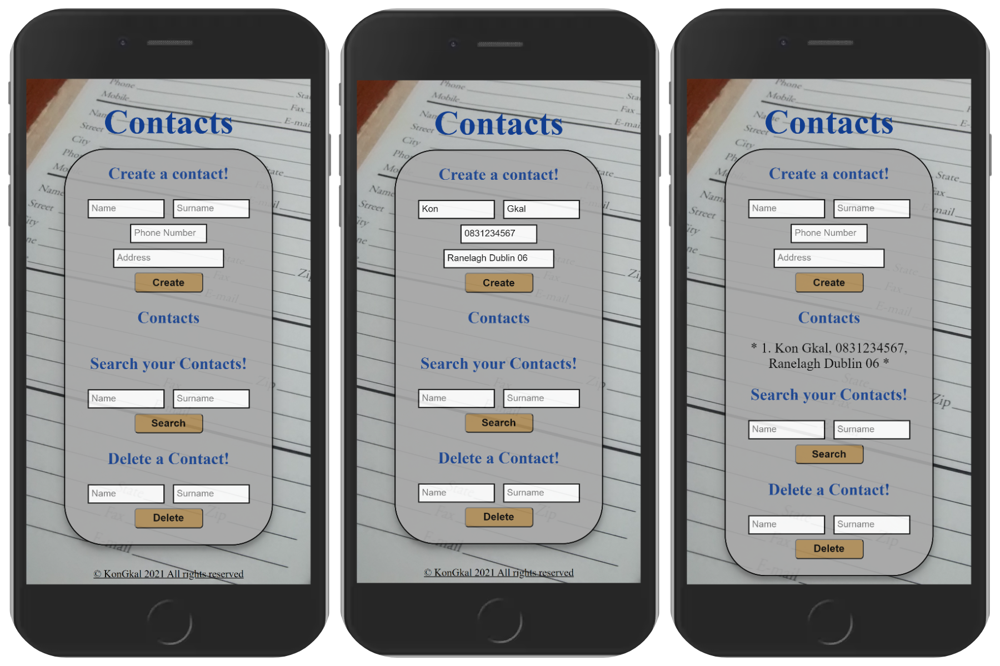

# Contacts
An app that lets the user store, search and delete Contacts.

# Description
\
This was a coding assignment that i had to complete only using HTML, CSS and Javascript with JQuery.
My idea for the project was to use an array to store
all the data (as they wouldnt have to be stored permanently) that the users would submit.
I decided to use a class which will create Contacts (object instances)
and then i would push those objects in the array.
I would then manipulate the array to search, display and delete the objects.
I used getters to get the values of the object keys.

# Getting Started 

## 1. Clone the Repo 
\
`git clone https://github.com/KonGkal/Contacts`

## 2. Install dependencies
\
  Navigate into the `cd Contacts` and run `npm install`

## 3. Start the app
\
  Using VS Code install the `Live Server` extension.
  Once this is done right click on the `index.html` file and select
  `Open with Live Server`

